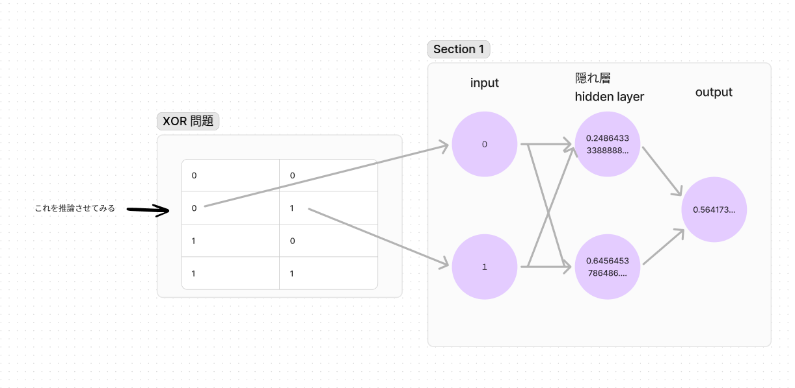
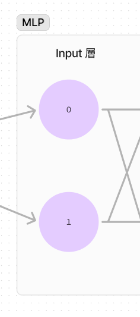
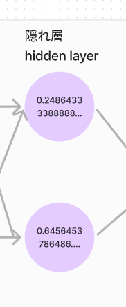
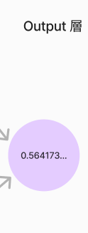
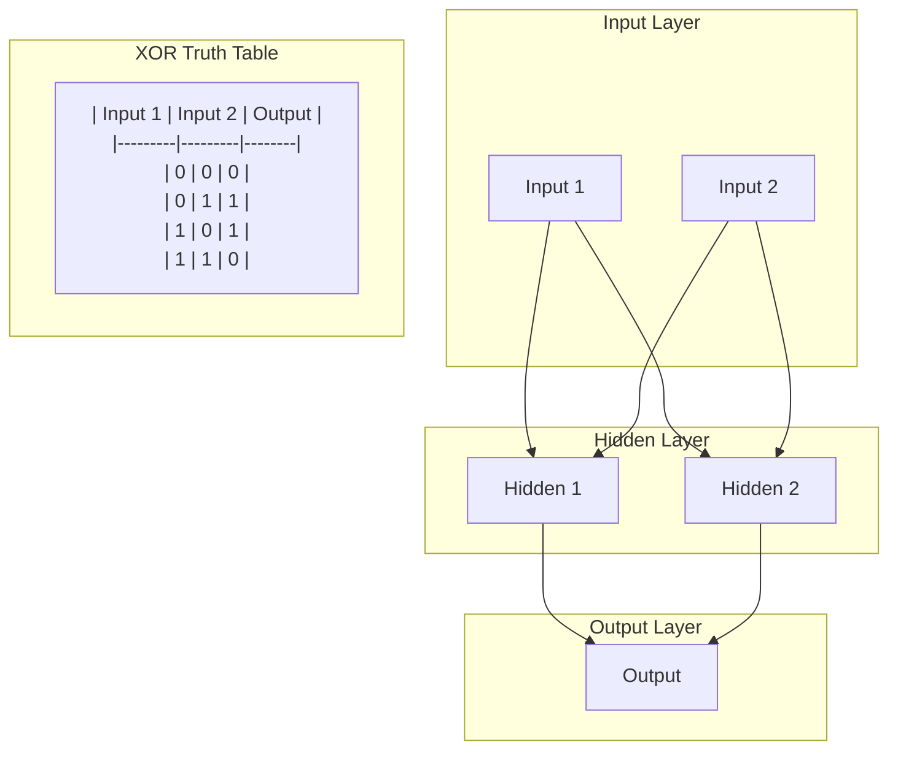

# 順伝播のみのパーセプトロンの解説

このコードではフィードフォワード（順伝播）のみの多層パーセプトロンを実装しています。

多層パーセプトロンはニューラルネットワークの一種です。単純にニューラルネットワークと思ってもらっても構いません。

ニューラルネットワークの簡単な説明はインターネットにたくさん落ちてあるのでそちらを参照してください。

また、順伝播というのは AI が答えを出すまでの計算の流れのことを指します。

ChatGPT がユーザーの入力を受け取って、それに対して応答を返すのもこの順伝播の一種です。

今回は **AI に XOR 問題を解かせてみます**。

## XOR 問題

XOR 問題は 2 つの入力が与えられたときに、その出力が異なる場合に 1 を返し、同じ場合に 0 を返す問題です。

| Input 1 | Input 2 | Output |
|---------|---------|--------|
|    0    |    0    |   0    |
|    0    |    1    |   1    |
|    1    |    0    |   1    |
|    1    |    1    |   0    |

上記のような真理値表を持つ問題です。

AI には Input 1 と Input 2 を与えて、Output を予測させます。

## 図解させてみる

多層パーセプトロンが XOR 問題を解く様子を図解してみます。

例として、XOR 問題の Input 1 に 0, Input 2 に 1 を与えた場合を図解してみます。

（答えは 1 です）

全体としてはこの通りになります。



まずは Input 層に渡されている値を見てみます。



一つ目のノードには 0 が、二つ目のノードには 1 が渡されています。

この Input 層は問題の入力を受け取る部分になるので XOR 問題の値がそのまま渡されています。

次に隠れ層を見てみます。



隠れ層のノードには変な値が渡されていますね。

これは Input 層の値に「重み」をかけて計算された値です。

この時、重みはランダムに初期化された値が使われているのでよくわからない値になっています。

最後に出力層を見てみます。



ここでは答えの値が計算されています。最後の出力層が AI が考えるこの問題の答えになります。

今回の問題の答えは 1 なので、本当は 1 に近い値を出力して欲しいところですが、ランダムな重みを使っているのでよくわからない値が出力されています。

いまはまだ学習を行っていないので当然っちゃ当然です。

これから学習を行って 1 に近い値が出力できるようになるのは次回以降のお話になってきます。


## コード解説

### 0. 行列の積の計算

まず、行列の計算から解説します。

行列の積の計算は多層パーセプトロンの原理を理解するために必須になります。
最初はぎょっとするかもしれませんが慣れてしまえば簡単です。

というのも、行列の計算を理解するのに必要な前提知識は**足し算と掛け算だけ**だからです。
なので、数学が苦手な方でも理解できるはずです。

行列の積の理解でつまずくポイントしては「どういう手続きで答えを出すか」という点にあります。
なので、苦手意識がある方は Youtube などで行列の積の計算方法を調べてみるといいかもしれません。

では本題です。

行列というのは、数値を縦横に並べたものです。

プログラミングでは二次元配列と同じようなものと考えてもらって構いません（実際には行列計算用のクラスを用いるので配列とは異なりますが）。

ruby で表現すると以下のようになります。

```ruby
require 'matrix'

a = Matrix[
  [1, 2, 3],
  [4, 5, 6]
]
```

また、これら行列を掛け合わせるときは普通に `*` 演算子を使います。

ただし注意しておかないといけないのは、行列の積は「左の行列の列数」と「右の行列の行数」が一致している必要があるということです。

#### 行列の積の計算例

ここで `2*3` 行列 `a` と `3*2` 行列 `b` の積を考えてみましょう。

```ruby
require 'matrix'

# 2x3行列（2行3列）
a = Matrix[
  [1, 2, 3],
  [4, 5, 6]
]
# 3x2行列（3行2列）
b = Matrix[
  [5, 6],
  [7, 8],
  [9, 10]
]

# 2x3行列と3x2行列の積 -> 2x2の行列になる
# i*j行列とj*k行列の積はi*k行列になるという性質があるので c は 2x2 の行列になる
# c = [
#   [1*5 + 2*7 + 3*9, 1*6 + 2*8 + 3*10],
#   [4*5 + 5*7 + 6*9, 4*6 + 5*8 + 6*10]
# ]
c = a * b
```

上記の `a` と `b` の積を計算するときは、`a` の列数が `3` で `b` の行数が `3` になるので計算可能になります。

逆に、`a` の列数と `b` の行数が一致していない場合は計算できません。

これは「行列の積の演算は前の行列の列数と後の行列の行数が一致していないと計算できない」ことが数学的に定義されているためです。

むずかしいかもしれませんが、簡単にいうとゼロ除算のような禁止事項があると考えてもらえればいいかと思います。
（ゼロ除算って数学的に定義されていないのでプログラムでエラーになりますよね。そんな感じです）

#### 行列の積の計算例（エラー）

次は次元が合ってない場合に行列の積が計算できないことを確認してみましょう。ruby で。

走らせてみるのは下記のコマンドです

```ruby
require 'matrix'
a = Matrix[[1,2,3],[4,5,6]]
b = a.clone
a * b
```

irb とかで試してみてください。

（matrix は標準ライブラリなので、インストールは不要です）

```sh
irb(main):006> a = Matrix[[1,2,3],[4,5,6]]
=> Matrix[[1, 2, 3], [4, 5, 6]]
irb(main):007> b = a.clone
=> Matrix[[1, 2, 3], [4, 5, 6]]
irb(main):008> a * b
/home/yamakoud/.local/share/mise/installs/ruby/3.3.4/lib/ruby/gems/3.3.0/gems/matrix-0.4.2/lib/matrix.rb:1070:in `*': Dimension mismatch (ExceptionForMatrix::ErrDimensionMismatch)
        from (irb):8:in `<main>'
        from <internal:kernel>:187:in `loop'
        from /home/yamakoud/.local/share/mise/installs/ruby/3.3.4/lib/ruby/gems/3.3.0/gems/irb-1.13.1/exe/irb:9:in `<top (required)>'
        from /home/yamakoud/.local/share/mise/installs/ruby/latest/bin/irb:25:in `load'
        from /home/yamakoud/.local/share/mise/installs/ruby/latest/bin/irb:25:in `<main>'
```

`2*3` 行列と `2*3` 行列の積は計算できないのでエラーになりました。


#### 行列の積の計算例（練習問題）

下記 4 種類の計算に関して「計算可能かどうか」と「答えの行列のサイズ」を答えてください。
また、それぞれ ruby の Matrix クラスを用いて実装してみてください。

1. `4*2` 行列 `a` と `3*2` 行列 `b` の積
1. `2*4` 行列 `a` と `4*3` 行列 `b` の積
1. `3*3` 行列 `a` と `3*3` 行列 `b` の積
1. `3*4` 行列 `a` と `3*2` 行列 `b` の積

### 1. 処理の流れを理解する

ここまででやっと本題に入れます。

実装は [./mlp.rb](./mlp.rb) にありますので、一旦全体を見てみたい方はそちらへ。

では最初に処理の流れを見ていきましょう。
おおまかな流れは下記になります。

1. 多層パーセプトロンのネットワークを初期化する（重みの初期化）
2. AI に渡す値を設定する
3. 順伝播を行う
   1. 入力層の値を隠れ層に伝播する
   2. 隠れ層の値を出力層に伝播する
   3. 出力層の値を計算する
4. 出力層の値を返す


#### 初期化処理

最初のステップである初期化の部分を見ていきましょう。
ForwardOnlyMLP の initialize メソッドの部分になります。

```ruby
class ForwardOnlyMLP
  def initialize(input_size, hidden_size, output_size)
    @w1 = Matrix.build(input_size, hidden_size) { rand(-1.0..1.0) }
    @w2 = Matrix.build(hidden_size, output_size) { rand(-1.0..1.0) }
  end
end

# モデルの初期化
mlp = ForwardOnlyMLP.new(2, 2, 1)
```

ForwardOnlyMLP の initialize メソッドでは input_size が 2, hidden_size が 2, output_size が 1 で初期化されています。

input_size 2 にしているのは XOR 問題が `[1,0]` のような長さが 2 の配列を入力として受け取るためです。

次に、hidden_size 2 は隠れ層のノード数を表しています。
これは適当に決めています。
現段階では数が多くなるほどモデルは賢くなるんだなぁぐらいの理解で大丈夫です。

output_size は答えの配列の長さを表しています。
今回の場合では 1 or 0 のどちらか（つまり長さが 1 の配列）になるので 1 を指定しています。

図としては下記のようになります。



### 2. 計算してみる

では実際にコードを動かしてみてください。

```sh
λ ~/Projects/learn-neural-net-sbs/ main ruby 1/mlp.rb
入力: [0, 0], 正解: [0], 予測: [0.4944310310768046]
入力: [0, 1], 正解: [1], 予測: [0.4941079007262597]
入力: [1, 0], 正解: [1], 予測: [0.49332494023204587]
入力: [1, 1], 正解: [0], 予測: [0.49302156164978905]
```

このような出力が得られるはずです。

現時点では学習をさせているわけではないので全く意味の無い値が出力されているかと思います。

本来であれば 0 か 1 に近い値を出力してほしいところです。

ですが、今はまだ学習を行う機能が追加されていないため何をしてもでたらめな値が出力されるだけです。

---

#### なぜ毎回異なる値が出力されるのか？

何回か実行してみると毎回異なる値が出力されることに気づくかもしれません。

一体なぜ出力ごとに変わるのでしょうか・・・？

答えは重みの初期化にあります。

重みの初期化の処理では `rand(-1.0..1.0)` という処理をしています。
なので、毎回異なる重みでニューラルネットワークが初期化されます。

自然に出力も異なる値になります。

このような重みのランダムな初期化はよく使われる手法なので軽く覚えておきましょう。


### まとめ

ここまでで多層パーセプトロンの順伝播の計算を行うコードを見てきました。

- 行列の積の計算
- 多層パーセプトロンの初期化
- 順伝播の計算
- 出力の取得

次回は逆伝播を行うコードを見ていきます。

逆伝播とはまぁ学習のことですね。
学習する機能を実装すれば AI が XOR 問題を解くことができるようになります。

# 改善点

1. 専門用語の説明：
   「順伝播」や「パーセプトロン」などの用語が最初に出てきたときに、もう少し詳しい説明があると良いかもしれません。AI初心者にとっては、これらの用語が分かりにくい可能性があります。

2. コードの詳細な解説：
   `ForwardOnlyMLP` クラスの実装について、特にforward methodの内部処理についてもう少し詳しい解説があると良いでしょう。例えば、シグモイド関数の役割や、なぜそれを使用するのかなどの説明が加わると、理解が深まります。

3. 数式の使用：
   行列計算や順伝播の計算過程を説明する際に、数式を用いるとより厳密な理解につながる可能性があります。ただし、数学が苦手な読者への配慮も必要です。

10. 質問セクション：
    読者が自身の理解度をチェックできるような簡単な質問や演習問題を追加すると良いでしょう。