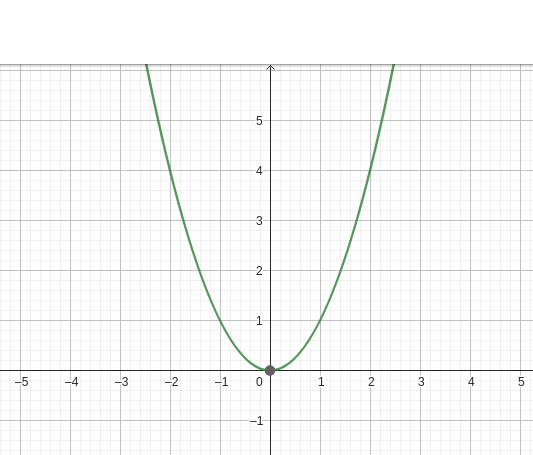

# 逆伝播

逆伝播とはつまり学習のことです。

これがあるから AI とも言えるぐらい重要な機能の実装になるのでしっかり理解してください。

## 1. イントロダクション

先程も述べたように、逆伝播は AI の学習を行うために必要な機能です。

これは人間で例えると試験で間違えた問題を振り返って、次回に同じ問題が出たときに正解できるようにすることに似ています。

AI の場合は、間違えた問題を振り返ることを **誤差逆伝播** と言います。

誤差逆伝播のプロセスは下記のようになります。

1. AI に問題を解かせてみる
2. AI が出した答えと正解を比較して「どのくらい間違えているか」を計算する
3. AI の考え方（重み）を修正する

AI が重みを更新するとき、「間違えてれば間違えているほど大きく修正する」という考え方を取ります。
この機構は損失関数のところで詳しく解説します。

## 2. 微分と導関数

AI の誤差逆伝播のプロセスでは微分と導関数を扱います。挫折した人も多いかもしれませんが概念的な理解だけで大丈夫なので安心してください。

微分とは、ある関数の傾きを求める操作です。

下記は y = 2x のグラフです。このグラフでは常に x が 1 増えると y は 2 増えます。
なので傾きは常に 2 になります。

なんで傾きの話をしてるのかと思うかもしれませんが、AI に学習させるときはこの傾きを与えることでどのくらい間違えたかを教えるからです。

AI はこの傾きが大きければ大きいほど「間違えた！」と思います。傾きが 4 のときは傾きが 2 のときよりも「間違えた！」と思いやすいのです。

### 例：一次関数の場合の傾きと導関数

では、まずは一次関数の場合から傾きと導関数を解説します。

`y = 2x` という関数について考えてみましょう。

この関数の傾きは常に 2 です。つまり y が 1 増えると x は 2 増えるということです。

ここで、導関数は `y = 2` と言えます。

導関数というのは「ある関数の傾きを求めるための関数」です。

上記の導関数から、y が 3 のときでも 4 のときでも 100000 のときでも傾きは常に 2 になることがわかります。

例えば `x = 3` ならば、導関数 `y = 2` なので傾きは 2 になります。

`x = 4` ならば、導関数 `y = 2` なので傾きは 2 になります。

`x = 100000` ならば、導関数 `y = 2` なので傾きは 2 になります。

まぁすごい当然っちゃ当然ですがまずは一番シンプルな一次関数の例で傾きと導関数の関係を理解してください。

### 例：二次関数

次に二次関数を考えてみましょう。

一次関数の場合は傾きが常に一定でしたが、二次関数の場合は `x` によって傾きが変わります。

こうなるとちょっと難しくなってきますが、導関数を使えば簡単に傾きを求めることができます。

例えば `y = x^2` という関数があるとき、導関数は `y = 2x` になります。

（導関数の導出方法については興味がある方は調べてみてください。）

これを使うと `y = 1` のときの傾きは 2、`y = 2` のときの傾きは 4 といった具合に求めることができます。

自分で二次関数のグラフを描いて、導関数を求めて傾きを求めてみると理解が深まるかもしれません。

## 導関数と微分の重要性

ここまでで導関数を用いると関数の傾きを求めることができることがわかりました。

## 3. 逆伝播の基本概念
- 誤差の逆伝播と重みの更新の概念
- 損失関数と勾配降下法の簡単な説明

## 4. 逆伝播アルゴリズムの詳細
- 出力層の誤差計算
- 隠れ層への誤差伝播
- 重みの更新プロセス

## 5. コードによる実装
- BackpropMLPクラスの設計
- 順伝播メソッドの実装（復習）
- 逆伝播メソッドの実装
- 学習プロセス全体の実装

## 6. XOR問題への適用
- 学習データの準備
- モデルの初期化と学習
- 学習結果の確認

## 7. 結果の解釈
- 学習前後の予測結果の比較
- 簡単な性能評価

## 8. 重要な考慮点と発展的トピック
- 学習率の重要性
- 過学習と未学習の概念の紹介
- その他の最適化技術や発展的トピックの示唆
  （例：他の活性化関数、より複雑なネットワーク構造、バッチ学習など）

## 9. まとめ
- 学んだ内容の要約
- 逆伝播の実装における重要ポイントの再確認

## 10. 次のステップ
- さらに学習を深めるためのリソース紹介

## 追加
- 損失関数